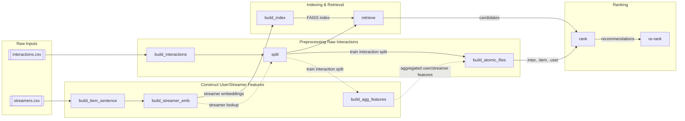

# Project
A multi-stage recommender system pipeline (retrieval -> ranking -> re-ranking) for livestreaming interactions. 

# Environment 
* All required dependencies are listed under the `env/` directory.
* Python 3.9 or higher is required.

# Directory Layout

```
├── data
│   ├── atomic          # atomic files for RecBole
│   ├── processed       # processed interactions data
│   ├── raw             # raw dataset
│   └── splits          # train, validation, testing
├── embeddings          # generated embeddings
├── env             
├── features            # item_sentence, aggregated user/item features
├── index               # FAISS indices
├── Makefile
├── README.md
├── results             # retrieval, ranking, reranking outputs
└── src                 # source code and checkpoints
    ├── config.py     
    ├── encoder         # retrieval encoder
    ├── eval            # evaluation scripts
    ├── indexing        # build FAISS indices  
    ├── preprocessing   # scripts for preprocessing dataset
    ├── ranker          # torch & RecBole ranker
    ├── representations # wrapper to map id with its corresponding embedding
    ├── reranker        # re-ranker object
    └── retrieval       # wrapper to run two-tower retrieval
```

# Usage
## Run the full pipeline
```bash
make all
```
This will run through preprocssing -> retrieval -> ranking -> reranking. 

### Notes
* You may need to change environment from `ml_env` to `recbole` to run `BPR` and `SASRec` ranker. 
* You need to download the raw dataset and corresponding checkpoints first to run the full pipeline. 


## Run individual stages
```bash
make dirs                   # create necessary directories
make build_interactions     # preprocess interaction data from raw csv file, filter based on enter/donate interactions 
make build_item_sentence    # construct streamer item sentence from raw streamer CSV
make build_streamer_emb     # generate embeddings for streamers based on selected column
make build_index            # build FAISS index for retrieval
make split                  # split the processed interactions into train/validation/test (with repeat vs. nodel)
make retrieve               # retrieve top-K candidates using FAISS
make rank                   # apply ranker (BPR, SASRec)
make rerank                 # apply reranking strategy (MMR)
```

## Workflow



### Stage descriptions:
#### Notation
* `RAW_DIR` = `data/raw/<DATASET>/<DATA_VERSION>`
* `PROC_DIR` = `data/processed/<DATASET>/<DATA_VERSION>/<INTERACTION_TYPE>`
* `FEAT_DIR` = `features/<DATASET>/<DATA_VERSION>/<SPLIT_ID>`
* `EMB_DIR` = `embeddings/<DATASET>/<DATA_VERSION>/<SPLIT_ID>/<RETR_PROFILE>`
* `IDX_DIR` = `index/faiss/<DATASET>/<DATA_VERSION>/<SPLIT_ID>/<RETR_PROFILE>`
* `SPLIT_DIR` = `data/splits/<DATASET>/<DATA_VERSION>/<INTERACTION_TYPE>/<SPLIT_ID>`
* `RES_DIR` = `results/<DATASET>/<DATA_VERSION>/<SPLIT_ID>/<RETR_PROFILE>`

#### Steps:
* __build_interactions__: 
    * Preprocess raw interaction logs (filter by interaction type)
    * __Input__: `RAW_DIR/interactions.csv`
    * __Output__: `PROC_DIR/latest.parquet`
* __build_item_sentence__: 
    * Generate descriptive sentences for streamers. (item_sentence / format_sentence)
    * __Input__: `RAW_DIR/streamers.csv`
    * __Output__: `FEAT_DIR/item_sentence/latest.parquet`
* __build_streamer_emb__:
    * Encode streamer sentences into embeddings
    * __Input__: `FEAT_DIR/item_sentence/latest.parquet`
    * __Output__: `EMB_DIR/streamer/embeddings.npy`
* __build_index__:
    * Build FAISS index for retrieval
    * __Input__: streamer embeddings
    * __Output__: `IDX_DIR/index.idx`
* __split__: 
    * Split the processed interactions into train/validation/test (with repeat vs. nodel)
    * __Input__: 
        * processed interactions parquet
        * streamer lookup
    * __Output__: 
        * `SPLIT_DIR/{train.parquet, val.parquet, test.parquet}`
        * `SPLIT_DIR/interactions_train.parquet`
        * `SPLIT_DIR/repeat_novel/{repeat.parquet, novel.parquet}`
* __retrieve__:
    * Retrieve top-K candidates using FAISS
    * __Input__: test split, index, embeddings, train interactions
    * __Output__: `RES_DIR/retrieved/`
        * JSON per user (`user_{user_id}.json`)
* __rank__:
    * Apply ranker (BPR, SASRec)
    * __Input__: test split, retrieved directory, atomic file of train split, RecBole checkpoint, RecBole config
    * __Output__: `RES_DIR/retrieved/ranked/`
        * JSON per user (`user_{user_id}.json`)
* __rerank__:
    * Apply reranking strategy (e.g., MMR)
    * __Input__: test split, ranked result, streamer embeddings
    * __Output__: `RES_DIR/retrieved/reranked/`
        * JSON per user (`user_{user_id}.json`)

## Evaluation
Evaluate different stages:
```bash
make eval_retrieval
make eval_ranking
make eval_reranking
```
Outputs metrics on:
* Full dataset
* Repeat interactions
* Novel interactions

## Configurable Parameters (Makefile knobs)
You can override defaults via CLI, e.g., `make rank RANKER_MODEL=SASRec`.

| Variable            | Options                            | Default                           | Description                 |
| ------------------- | ---------------------------------- | --------------------------------- | --------------------------- |
| `DATASET`           | livestream                         | livestream                        | Dataset name                |
| `DATA_VERSION`      | YYYY-MM-DD                         | 2025-06-30                        | Data version                |
| `INTERACTION_TYPE`  | donate \| enter                    | donate                            | Type of user interaction    |
| `EMB_COL`           | item\_sentence \| format\_sentence | item\_sentence                    | Feature column for encoding |
| `RETRIEVAL_ENCODER` | MiniLM \| bge \| others            | MiniLM                            | Encoder backbone            |
| `INDEX_TYPE`        | flat \| hnsw \| ivf                | flat                              | FAISS index type            |
| `RANKER_MODEL`      | BPR \| SASRec                      | BPR                               | Ranking model               |
| `RERANK_STRATEGY`   | mmr \| others                      | mmr                               | Re-ranking strategy         |
| `SPLIT_TYPE`        | time \| random                     | time                              | Train/test split strategy   |
| `FILTER`            | heavy\_filter\_missing\_streamers  | heavy\_filter\_missing\_streamers | Filtering strategy          |

### Directory Naming
Currently, we use Split ID and Retrieval Profile to manage the artifacts of each stage. 
* Split ID (`SPLIT_ID`) = `INTERACTION_TYPE`_`SPLIT_TYPE`_`FILTER`
    * Example: `donate_time_heavy_filter_missing_streamers`
* Retrieval Profile (`RETR_PROFILE`) = `EMB_COL`_`RETRIEVAL_ENCODER`_`INDEX_TYPE`
    * Example: `item_sentence_MiniLM_flat`

### Notes on `FILTER`
* The `FILTER` variable only affects the directory ID (for naming consistency).
* Filtering logic (e.g., `--filter-missing-streamers`, `--filter-too-few-streamers`) is currently hardcoded in Makefile. 
    * `--filter-missing-streamers`: filter out users' interactions with streamers without embedding
        * filter\_missing\_streamers tag
    * `--filter-too-few-streamers`: filter out users who interacted with less than 5 unique streamers
        * heavy tag
    * __heavy\_filter\_missing\_streamers__: we set the two filter conditions to True
* Changing `FILTER` alone will not alter preprocessing behavior. Check of Makefile for more details. 

## Notes on RecBole Ranker
* The RecBole package requires specific versions of PyTorch and NumPy. You may need to activate the `recbole` environment to run the ranker.
* Since we hardcoded the dataset directory for training RecBole models in the config files, the atomic files required by the model do not follow the directory naming convention based on Split ID and Retrieval Profile. Future work may need to refactor this part.
* If you'd like to run `SASRecF` to incorporate item embeddings, you'll need to apply our local bug fix to RecBole, follow these steps:

```bash
# Clone the official RecBole repo
git clone https://github.com/RUCAIBox/RecBole.git
cd RecBole

# Apply the diff stored in this repository
git apply ../src/ranker/recbole/recbole_fix.diff

# Install the patched version locally
pip install -e .

```
After installation, all ranker scripts will use the patched RecBole instead of the remote PyPI package. 

Please refer to the following link for the details:
https://github.com/RUCAIBox/RecBole/issues/2104


## Raw Dataset
Please refer to `/nas02/home/kevin/recsys_pipeline/data/raw/livestream/2025-06-30` for the raw dataset used in this experiement. 

## Checkpoints
* Checkpoints for two-tower retrieval encoder are stored under `/nas02/home/kevin/recsys_pipeline/src/encoder/checkpoints/epoch40`. 
* Checkpoints for RecBole ranker are stored under `/nas02/home/kevin/recsys_pipeline/src/ranker/recbole/checkpoints`. 
* Checkpoints for torch ranker are stored under `/nas02/home/kevin/recsys_pipeline/src/ranker/torch/checkpoints`. 


# Training
## Retrieval encoder
To reproduce encoder checkpoints, you can train the retrieval encoder with the following command:
```bash
python -m src.encoder.train_encoder \
    --item-corpus <path_to_item_sentence> \
    --train-interactions <path_to_interactions_train.parquet> \
    --val-split-path <path_to_validation_file> \
    --output-dir <path_to_store_ckpt> \
    --epochs <epochs> \
    --patience <patiences> \
    --batch-size <batch-size> \
    --lr <learning_rate> \
    --margin <Margin for triplet loss> \
```
Note that the dataset used for the current released checkpoint was built from aggregated user interactions (i.e., each user–item pair appears only once). If you train on the interactions split with recurring interactions, your results may differ from the provided checkpoint. 

This code will conduct early stopping based on training loss. If you prefer validation-based early stopping, use the trainer with YAML config: 
```bash
python -m src.encoder.train.run_trainer \
    --config <path_to_yaml_config>
```
Note that the `run_trainer` implementation may currently encounter out-of-memory (OOM) errors that are not yet resolved. 

## Ranker
To reproduce ranker checkpoints, you can train the selected trainer with the following command: 
```bash
python src.ranker.recbole.run_train.py \
    --config <path_to_config_file> \
    --ckpt-dir <path_to_checkpoint_directory>
```